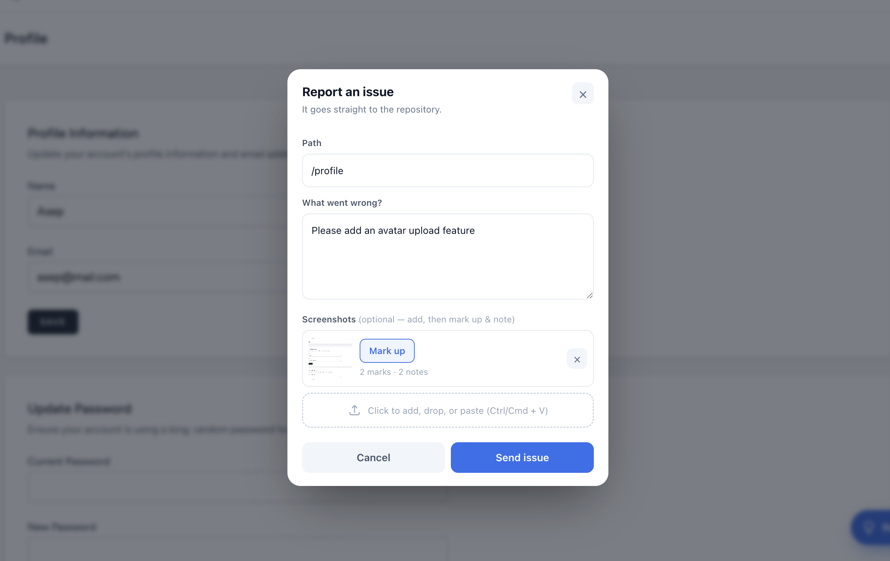
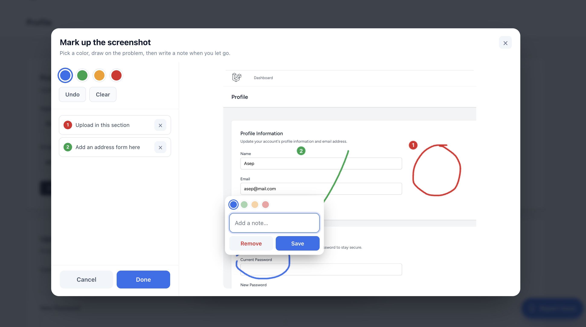
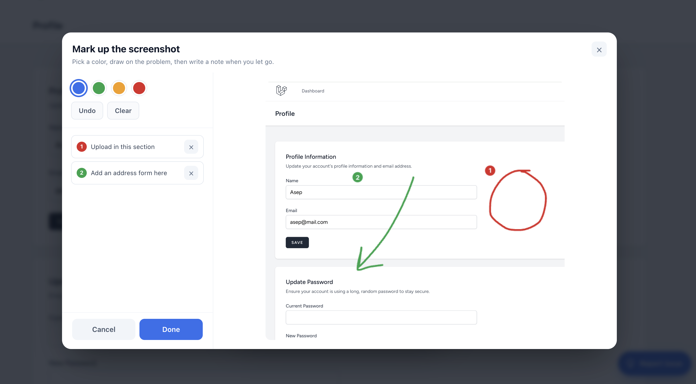

# Feedback Now

A floating "Report issue" button for the Laravel apps you ship to clients. The client clicks it on any page, types what went wrong, drops in a few screenshots, and it lands as an issue in your GitHub or GitLab repo.

The point is to close the loop between the people using your app and the AI that fixes it. Your client reports the bug in plain words with a screenshot. The issue carries the exact path and context. Then your coding agent (Claude Code, Cursor, whatever you run) reads the issue and ships the fix. No more "the thing is broken" over WhatsApp.

Install once and it shows on every page. No layout edits, no frontend build.



## Setup

```bash
composer require hexters/feedback-now
php artisan vendor:publish --tag=feedback-now-config
```

Three values in `.env`. The button turns on wherever a token is set, so leaving the token out of production keeps it off there.

GitHub:

```dotenv
FEEDBACK_NOW_PROVIDER=github
FEEDBACK_NOW_TOKEN=ghp_xxx
FEEDBACK_NOW_REPO=owner/repo
```

GitLab:

```dotenv
FEEDBACK_NOW_PROVIDER=gitlab
FEEDBACK_NOW_TOKEN=glpat-xxx
FEEDBACK_NOW_REPO=12345
# FEEDBACK_NOW_GITLAB_HOST=https://gitlab.example.com   # self-hosted
```

### The token

On GitHub it has to be a **classic** personal access token, not a fine-grained one. Create it under Settings → Developer settings → Personal access tokens → Tokens (classic) and tick the `repo` scope.

Give it an expiry that matches the work: 6 months, or just the length of the testing phase. When it lapses the button stops working until you replace it, which is what you want for a token that can write to your repo. On GitLab, use a token with the `api` scope and set an expiry the same way.

That is the whole setup.

## Mark up the screenshot

This is the part clients actually enjoy. They pick a color, draw on what's wrong, and a note box pops up right where they drew. Each mark is numbered and color-coded, then burned into the image and listed in the issue, so every note points to its mark.





## What lands in the issue

- The page path where it happened
- The client's description as the title and body
- Any screenshots the client marked up, with their color-coded notes (committed to the repo on GitHub, uploaded through the API on GitLab)
- Who reported it and which browser

Structured enough that a coding agent can pick it up and act on it.

## Customizing

Edit `config/feedback-now.php` for the button label, position and color, the issue labels and title prefix, the screenshot path, or the upload size limit.

## Notes

- Active only where a token is set, so it stays off in production by default.
- The endpoint is rate limited.
- Requires PHP 8.2+ and Laravel 11, 12 or 13.

## License

MIT.
